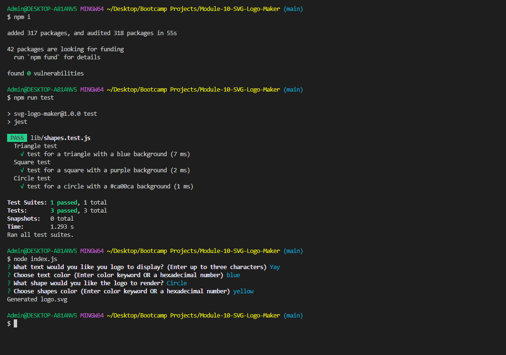

# Module-10-SVG-Logo-Maker

## Application helps users to build logo with different shapes and with option to change shape color, font color using prompts. After answering all the questions, file logo.svg is generated. 

## link to the video

https://drive.google.com/file/d/12W3tSgyWZ2Sp2RLmRTImzTRwkhaXyeV8/view?usp=sharing

## screenshot showing functionality

## link to github repository
https://github.com/Rubal103/Module-10-SVG-Logo-Maker

